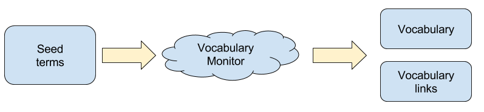
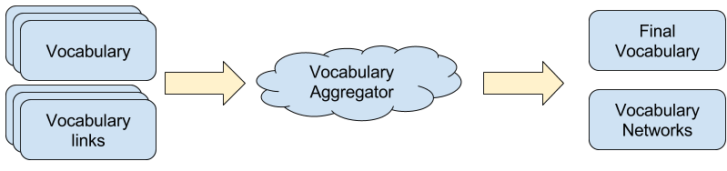
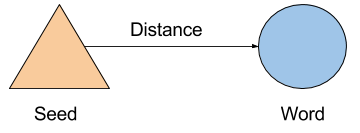
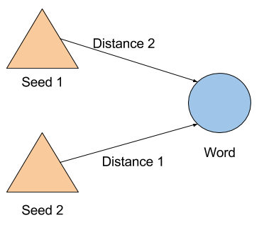
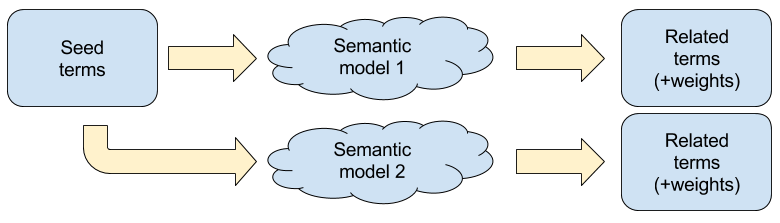
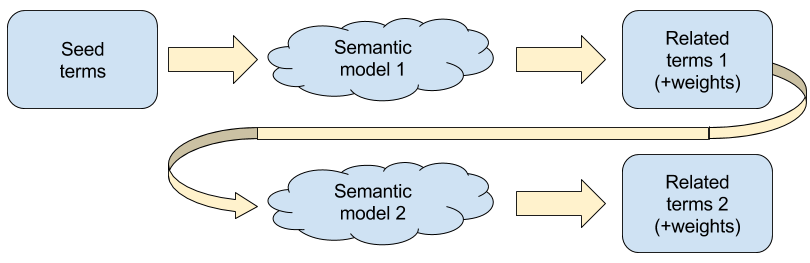
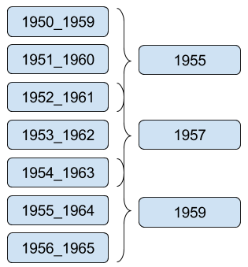
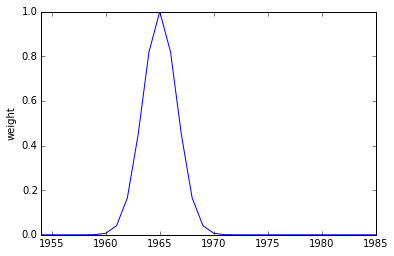
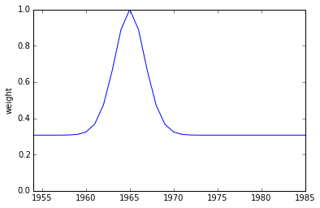
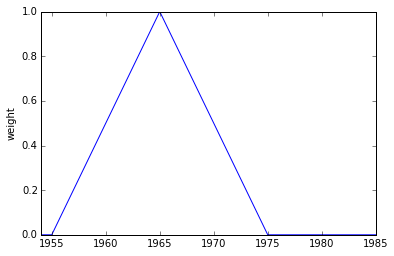

# How does ShiCo work?

Given a set of seed terms, ShiCo uses its semantic models to generate a vocabulary of related terms. This process is done for every one of the semantic models available. This is done using a *Vocabulary Monitor*. The vocabulary monitor generates a vocabulary of related terms and a list of vocabulary links, which explains which of the related terms was generated by which one of the seed terms.



The produced vocabularies and links are then aggregated using a *Vocabulary Aggregator* -- the vocabulary aggregator groups together results from multiple models into a single final vocabulary. This has a smoothing effect on the produced vocabulary.



## Vocabulary Monitor

The vocabulary monitor uses the given terms to query the semantic models. The models provide a list of *related words* and some measure of how closely related they are to the seed term -- this is interpreted as a *distance* between the seed term and the related word:



As mentioned before, from each model the vocabulary monitor generates a vocabulary and list of vocabulary links. The vocabulary is a list of terms related to the seed terms -- each term is assigned a *weight*. This weight is calculated in one of two ways:
 - As a count of the number of times the term appears
 - As a sum of the distance between the seed terms and the related term

These weightings start from the assumption that a related term can appear as the result of one or more seed terms, in which case each time it increases the weight assigned to the related term.



In this way, the weights of each word are the sum of the weight contribution from each seed.

```
weights(word1) = weight(word1,seed1)
weights(word2) = weight(word2,seed1) + weight(word2,seed2)
...
```

The vocabulary monitor limits the number of words in the generated vocabulary, only the *N* words with the highest weights are included in the vocabulary.

```
word1: weights(word1)
word2: weights(word2)
...
wordN: weights(wordN)
-------- cut point
wordN+1: weights(wordN+1)  # dropped
wordN+2: weights(wordN+2)  # dropped
...                        # dropped
```

### Algorithms

The vocabulary monitor contains can use two different algorithms for generating vocabularies. These control which words are used as seed terms for each model.

#### Non-adaptive

The non-adaptive vocabulary generator uses the same seed terms each time to generate the related terms.



#### Adaptive

The adaptive vocabulary generator uses the related terms generated by one semantic model as seed terms for the next semantic model.



This adds an additional possibility: it allows for the semantic models to be used in chronological order, or in reverse chronological order -- searching forwards or backwards in time.

For more details, please refer to [this paper](#Wevers DH2015).


## Vocabulary Aggregator

A vocabulary aggregator takes a vocabulary produced by a vocabulary monitor and aggregates them over a set time window.



Weighting functions are used to aggregate topics in a year:

Terms inside the 'window', are weighted by a weighting function.

### Gaussian



### JSD


### Linear


For more details, please refer to [this paper](#Wevers DH2015).

# References
##### Wevers DH2015
Wevers, M.; Kenter, T. and Huijnen, P. Concepts Through Time: Tracing Concepts in Dutch Newspaper Discourse (1890-1990) using Word Embeddings. In Digital Humanities 2015 (DH2015), 2015.
