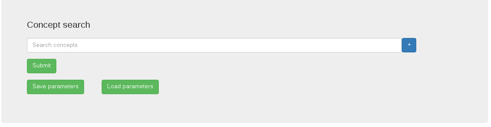
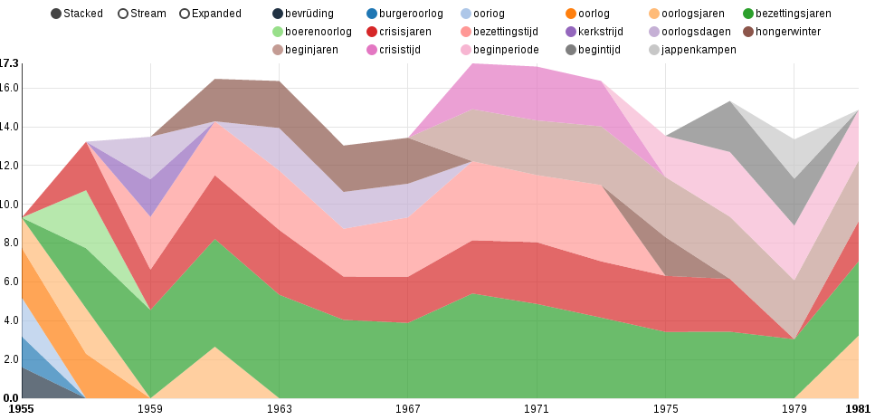
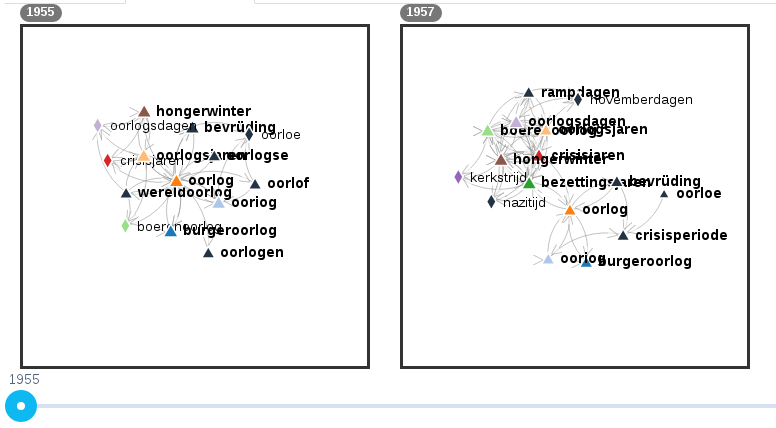
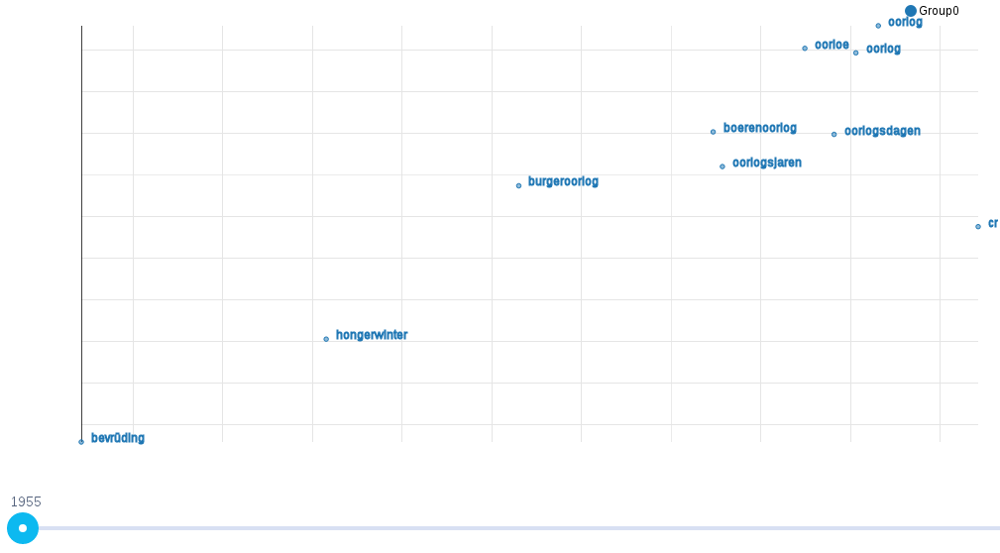

# How to use ShiCo?

This guide will instruct you in the elements for using ShiCo's user interface.

## User interface components

When you first open ShiCo on your browser, you will see a simple search bar:

You can enter one or multiple (comma separated) *seed terms*. These seed terms are the entry point for your concept search. Click *Submit* to begin your search. The results from your search will be displayed in the results panel below the search bar.

The search bar has some additional features:
 - It allows you to modify the search parameters. Click the *+* button to display additional search parameters.
 - It allows you to save the parameters of your current search, or load the parameters of a previous search.

## Search parameters

The following is the list of parameters (with a link to a brief explanation) which can be used to control your concept search:

 - [Max Terms](/webapp/src/help/maxTerms.md)
 - [Max related terms](/webapp/src/help/maxRelatedTerms.md)
 - [Minimum concept similarity](/webapp/src/help/minSim.md)
 - [Word boost](/webapp/src/help/wordBoost.md)
 - [Boost method](/webapp/src/help/boostMethod.md)
 - [Algorithm](/webapp/src/help/algorithm.md)
 - [Track direction](/webapp/src/help/direction.md)
 - [Years in interval](/webapp/src/help/yearsInInterval.md)
 - [Words per year](/webapp/src/help/wordsPerYear.md)
 - [Weighing function](/webapp/src/help/weighFunc.md)
 - [Function shape](/webapp/src/help/wFParam.md)
 - [Do cleaning ?](/webapp/src/help/doCleaning.md) (only shown if your backend uses a cleaning function).
 - [Year period](/webapp/src/help/yearPeriod.md)

## Produced graphics

Once a search is complete, ShiCo displays results in the results panel. Results are displayed using various graphs:

 - Stream graph -- this shows each word of the resulting vocabulary as a stream over time. The stream gets wider or narrower  according to the weight the word is given in the vocabulary.

 - Network graphs -- this shows a collection of graphs displaying the resulting vocabulary as a network graph. Words which are related to each other are connected with an arrow. The direction of the arrow indicates which word was the product of which seed word.

 - Space embedding -- this shows an estimate of the spatial relationship between words in the final vocabulary at every time step. Please keep in mind that these spatial relations are approximate and should be considered with care.

 - Plain text vocabulary -- this shows a text representation of the concept search. This consists, for each time step, of the seed words used and the produced vocabulary.

## Saving and loading search parameters

When you click the *Save parameters* button, a text box with your search parameters will be displayed. Copy these parameters and save them somewhere. Click *Ok* to hide the text box.

When you click the *Load parameters* button, another text box will be displayed. Enter previously saved search parameters in this box and click *Ok* to load the parameters.
